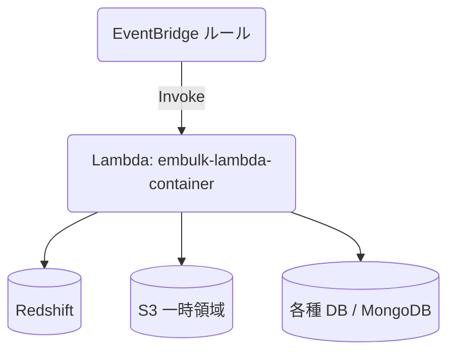

## はじめに

Embulkを触って最初に思ったのは「これ、どこで動かそうか？？」
直感的にLambdaが良いなと思ったものの、調べてもあまり情報もなく、スッキリした構成を取るのにも色々検討したのでオススメとして紹介します。

また以前、執筆した[Dockerを活用したLambdaの開発＆本番環境のおすすめ構成](https://zenn.dev/konan/articles/efd004b1810463)を元に、Docker×Lambdaで本番環境を構築した上で、開発環境も一貫性のある作りにしています。


*※どっちもクジラ！！*

## サンプルコード

本記事で解説するコード一式は、以下のGitHubリポジトリで公開しています：

**🔗 [embulk-lambda-container](https://github.com/konan0802/embulk-lambda-container)**

- 完全なDockerfile（マルチステージビルド）
- Lambda ハンドラの実装例  
- 3種類のデータソース設定ファイル（PostgreSQL、MySQL、MongoDB → Redshift）
- 環境構築からデプロイまでの手順書

記事と合わせてご活用ください。

## ディレクトリ構成
```
embulk-lambda-container/
├── Dockerfile
├── embulk.properties
├── config/
│   ├── config_users.yml.liquid
│   └── ... (各種テーブル・コレクションごとの設定ファイル)
├── src/
│   ├── main.py      # Lambdaハンドラ
│   └── requirements.txt
└── README.md
```

## Embulk × Lambda の課題
Embulk は Java 製で **JAR が 100 MB を超え**、利用するプラグインも JVM ベース――そのまま Lambda に突っ込むと下記の問題に突き当たります。

- デプロイサイズ制限（ZIP 50 MB）
- コールドスタート時間の増大
- メモリ / タイムアウト設定のチューニングが難しい

そこで今回は **Docker コンテナイメージ** で Lambda を動かし、`aws-lambda-java` と `aws-lambda-python` のマルチステージビルドで最小構成を目指しました。

## アーキテクチャ概要
- **Lambda (Container image)** : Embulk 実行本体
- **ECR** : コンテナレジストリ
- **EventBridge** : テーブル単位でスケジュール実行



## Dockerfileの解説
### マルチステージビルドの構成

**ステージ1: Java builder** - Embulkとプラグインを準備
```dockerfile
FROM --platform=linux/amd64 amazon/aws-lambda-java:8.al2 AS java-builder

# Embulk本体とプラグインのダウンロード・インストール
ARG embulk_version=0.11.0
RUN wget -O /embulk/bin/embulk https://github.com/embulk/embulk/releases/download/v${embulk_version}/embulk-${embulk_version}.jar
# プラグインインストール処理...
```

**ステージ2: Lambda runtime** - 実行環境の構築
```dockerfile
FROM --platform=linux/amd64 amazon/aws-lambda-python:3.11

# ステージ1からEmbulkをコピー
COPY --from=java-builder /embulk /embulk

# Java runtime とPython依存関係をインストール
RUN yum install -y java-1.8.0-openjdk-headless
COPY src/main.py /var/task/
CMD [ "main.lambda_handler" ]
```

> 📄 **完全なDockerfile**: [リポジトリで確認](https://github.com/konan0802/embulk-lambda-container/blob/main/Dockerfile)

### 🔑 設計のポイント

1. **プラットフォーム固定**: `--platform=linux/amd64` でApple SiliconでもCI/CDを安定化
2. **マルチステージ最適化**: Embulk準備と実行環境を分離して軽量化（約300MB）
3. **JRuby安定版採用**: 9.3.10を使用（9.4系でタイムアウト回避）
4. **Pythonハンドラ**: コールドスタート短縮のためPythonでラップ
5. **レイヤーキャッシュ最適化**: 依存関係を先にコピーしてビルド高速化

## Lambda ハンドラの実装

### 核となるシンプルな処理フロー

```python
def lambda_handler(event: Dict[str, Any], context: Any) -> Dict[str, Any]:
    # 1. 設定ファイル名の取得
    config_file = event.get("config_file_name")
    
    # 2. Embulkコマンド実行（パフォーマンス最適化済み）
    cmd = ["java", "-Xmx6g", "-Xms2g", "-XX:+UseG1GC", 
           "-jar", "/embulk/bin/embulk", "run", config_path]
    
    # 3. タイムアウト制御（13分）
    result = subprocess.run(cmd, timeout=780)
    
    return {"statusCode": 200}
```

> 📄 **完全な実装**: [main.py](https://github.com/konan0802/embulk-lambda-container/blob/main/src/main.py)

### 🚀 パフォーマンス最適化のポイント

1. **メモリ管理**: `-Xmx6g / -Xms2g` で大容量データに対応
2. **GC最適化**: `G1GC` + `MaxGCPauseMillis=200` で停止時間最小化  
3. **タイムアウト制御**: Lambda上限15分の85%（13分）でエラーハンドリング
4. **ローカルテスト対応**: `__main__`ブロックで開発時も同じコードパス

## Embulk 設定ファイル（例）
`config/config_users.yml.liquid`
```yaml
in:
  type: postgresql
  host: {{ env.DB_HOST }}
  table: users
  select: "id, username, email, created_at, updated_at, status"
  ...
filters:
  - type: typecast
out:
  type: redshift
  table: users
  mode: merge
  merge: [id]
```
Liquid テンプレートと環境変数を組み合わせるだけで **新しいテーブルにもコピペで対応** できます。

## 実際の使用方法

### ローカル開発での動作確認

```bash
# 1. 環境変数設定
cp .env.sample .env
# .envファイルを編集してDB接続情報を設定

# 2. イメージビルド
docker build -t embulk-lambda-container .

# 3. 実行テスト
docker run --rm --env-file .env --entrypoint python embulk-lambda-container \
  main.py '{"config_file_name":"config_users.yml.liquid"}'
```

### 本番デプロイ

```bash
# ECRにプッシュ後、Lambda関数で「新しいイメージをデプロイ」するだけ
aws ecr get-login-password | docker login --username AWS --password-stdin $ECR_URL
docker push $ECR_URL/embulk-lambda-container:latest
```

## ARM64 (Apple Silicon) での注意
イメージは `linux/amd64` でビルドしています。M1/M2 Mac では Rosetta で動くため **3〜5 倍遅く** なります。ローカルテストは簡易確認に留め、CI では x86_64 ランナーを推奨します。

## まとめ
- Embulk v0.11 を **最小コード** + **単一 Dockerfile** で Lambda に載せた
- 設定ファイルは Liquid でテンプレート化し、**ジョブ追加はファイルを置くだけ**
- マルチステージビルドにより本番イメージを **300 MB 台** まで削減

これで Redshift への日次バルクロードが **サーバーレス & 高速 & 低コスト** で実現できました。ぜひ試してみて下さい！

---
## 参考記事
* [Dockerを活用したLambdaの開発＆本番環境のおすすめ構成](https://zenn.dev/konan/articles/efd004b1810463)
* [Embulk v0.11をAWS Lambda上で動かす](https://zenn.dev/ikoba/articles/run-embulk-on-lambda)