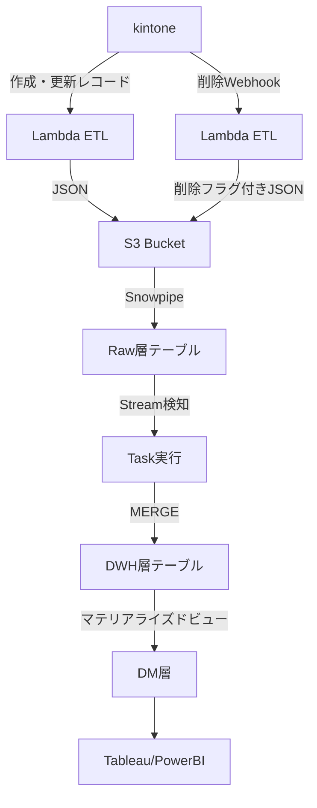

## はじめに

kintoneのデータを本格的に分析する際の技術選択は意外と難しい。。。

kintone標準のBI機能では物足りない一方で、外部BIツールを導入するには**データの取り込み**、**リアルタイム更新**、**スキーマ変更への対応**など、様々な技術的課題をクリアする必要があります。

そこで今回は、**Snowflakeのモダンな機能をフル活用**して**ニアリアルタイムETLを低コストで実現**する構成例を紹介します。

**🔥 この記事の特徴**
- **Snowpipe + Stream + Task** によるリアルタイムデータパイプライン
- **VARIANT型** でスキーマレスなデータ格納
- **3層アーキテクチャ**（Raw / DWH / DM）でデータ品質を段階的に向上
- **冪等性・削除対応・コスト最適化** を考慮した実践的な設計

この構成はkintoneに限らず、**SaaSデータをSnowflakeで処理する際の汎用的なパターン**として活用できます。

実際に本番環境で半年以上運用している構成を基に紹介します。

## 全体コンセプト

**Snowflakeを選択した理由**は、Snowpipe + Stream + Taskの組み合わせで**ニアリアルタイムETLを低コストで実現**できることにある。従来のETLツールやストリーミング処理基盤では複雑になりがちな構成を、標準機能のみでシンプルかつ安価に構築できる。

今回のアーキテクチャでは以下を重視している：

- **ニアリアルタイム性**：数分単位でkintoneの変更がSnowflake側に反映
- **スキーマ変更への柔軟性**：VARIANT型でkintone側の項目追加に対応
- **冪等性・削除対応**：同じデータの再投入や削除イベントを適切に処理

これらを3つのレイヤー（Raw、DWH、DM）構成で実現し、ETL処理にはdbtではなくSnowflake Taskを採用している。

## 全体アーキテクチャ

### データフロー概要



### 処理レイヤーの役割

1. **Raw層**：kintoneから取得した生データをそのまま格納（履歴保持）
2. **DWH層**：Raw層のデータを整形し、最新状態のみを保持（正規化済み）
3. **DM層**：ビジネスロジックを適用した分析用データマート

## 実装詳細

### 1. Raw層テーブル設計

```sql
-- kintone_rawテーブルの定義例
CREATE TABLE raw.kintone_deals (
    record_id NUMBER NOT NULL,
    app_id NUMBER NOT NULL,
    updated_at TIMESTAMP_NTZ NOT NULL,
    is_deleted BOOLEAN DEFAULT FALSE,
    body VARIANT,
    ingested_at TIMESTAMP_NTZ DEFAULT CURRENT_TIMESTAMP(),
    source_file STRING
);
```

### 🔑 設計のポイント

1. **VARIANT型活用**：kintoneのJSONデータをそのまま格納してスキーマ変更に柔軟対応
2. **削除フラグ**：`is_deleted`で論理削除を管理
3. **メタデータ保持**：`ingested_at`、`source_file`で運用時のトレーサビリティを確保
4. **複合キー**：`record_id`+`updated_at`で重複データの追跡が可能

### 2. Snowpipe設定

```sql
-- 外部ステージ作成
CREATE STAGE raw.kintone_stage
URL = 's3://your-bucket/kintone-data/'
STORAGE_INTEGRATION = your_s3_integration;

-- Snowpipe作成
CREATE PIPE raw.kintone_deals_pipe
AUTO_INGEST = TRUE
AS
COPY INTO raw.kintone_deals (record_id, app_id, updated_at, is_deleted, body, source_file)
FROM (
    SELECT 
        $1:record_id::NUMBER,
        $1:app_id::NUMBER,
        $1:updated_at::TIMESTAMP_NTZ,
        $1:is_deleted::BOOLEAN,
        $1:body::VARIANT,
        METADATA$FILENAME
    FROM @raw.kintone_stage
)
FILE_FORMAT = (TYPE = 'JSON');
```

### 3. DWH層のStream + Task

```sql
-- Raw層の変更を検知するStream
CREATE STREAM dwh.kintone_deals_stream ON TABLE raw.kintone_deals;

-- DWH層テーブル
CREATE TABLE dwh.deals (
    record_id NUMBER PRIMARY KEY,
    deal_name STRING,
    phase NUMBER,
    client_name STRING,
    amount NUMBER(15,2),
    expected_date DATE,
    created_at TIMESTAMP_NTZ,
    updated_at TIMESTAMP_NTZ,
    deleted_flag BOOLEAN DEFAULT FALSE
);

-- 自動更新Task
CREATE TASK dwh.update_deals_task
WAREHOUSE = 'COMPUTE_WH'
SCHEDULE = 'USING CRON 0/1 * * * * UTC'
WHEN SYSTEM$STREAM_HAS_DATA('dwh.kintone_deals_stream')
AS
MERGE INTO dwh.deals t
USING (
    SELECT 
        record_id,
        deal_name,
        phase,
        client_name,
        amount,
        expected_date,
        created_at,
        updated_at,
        is_deleted
    FROM (
        SELECT 
            record_id,
            body:deal_name::STRING as deal_name,
            body:phase::NUMBER as phase,
            body:client_name::STRING as client_name,
            body:amount::NUMBER(15,2) as amount,
            body:expected_date::DATE as expected_date,
            body:created_at::TIMESTAMP_NTZ as created_at,
            updated_at,
            is_deleted,
            ROW_NUMBER() OVER (PARTITION BY record_id ORDER BY updated_at DESC) as rn
        FROM dwh.kintone_deals_stream
    )
    WHERE rn = 1  -- 最新レコードのみ
) s ON t.record_id = s.record_id
WHEN MATCHED AND s.is_deleted = TRUE THEN DELETE
WHEN MATCHED AND s.is_deleted = FALSE THEN UPDATE SET
    deal_name = s.deal_name,
    phase = s.phase,
    client_name = s.client_name,
    amount = s.amount,
    expected_date = s.expected_date,
    updated_at = s.updated_at
WHEN NOT MATCHED AND s.is_deleted = FALSE THEN INSERT (
    record_id, deal_name, phase, client_name, amount, expected_date, created_at, updated_at
) VALUES (
    s.record_id, s.deal_name, s.phase, s.client_name, s.amount, s.expected_date, s.created_at, s.updated_at
);

-- Task開始
ALTER TASK dwh.update_deals_task RESUME;

### 4. ETL処理（Lambda関数例）

```python
import json
import boto3
import os
from datetime import datetime
import requests

def lambda_handler(event, context):
    """kintoneからの増分データを取得してS3に格納"""
    
    # 前回実行時刻から増分取得（Parameter Storeから取得）
    last_updated = get_last_updated_timestamp()
    
    # kintone APIで増分データ取得
    kintone_data = fetch_incremental_data(last_updated)
    
    if not kintone_data:
        return {"statusCode": 200, "message": "No new data"}
    
    # S3にJSON形式で保存
    s3_key = f"kintone-data/{datetime.now().strftime('%Y/%m/%d/%H/%M')}/deals.json"
    upload_to_s3(kintone_data, s3_key)
    
    # 次回実行用のタイムスタンプ更新
    update_last_timestamp(datetime.now().isoformat())
    
    return {"statusCode": 200, "processed_records": len(kintone_data)}

def fetch_incremental_data(since_timestamp):
    """kintone REST APIで作成・更新データを取得"""
    api_token = os.environ['KINTONE_API_TOKEN']
    base_url = os.environ['KINTONE_BASE_URL']
    app_id = os.environ['KINTONE_APP_ID']
    
    query = f'updated_at > "{since_timestamp}"'
    url = f"{base_url}/k/v1/records.json"
    headers = {
        'X-Cybozu-API-Token': api_token,
        'Content-Type': 'application/json'
    }
    params = {'app': app_id, 'query': query}
    
    response = requests.get(url, headers=headers, params=params)
    response.raise_for_status()
    
    return response.json().get('records', [])

def upload_to_s3(data, s3_key):
    """S3にJSONデータをアップロード"""
    s3_client = boto3.client('s3')
    bucket_name = os.environ['S3_BUCKET_NAME']
    
    # kintoneのレスポンス形式をSnowflake用に変換
    transformed_data = []
    for record in data:
        transformed_record = {
            'record_id': int(record['$id']['value']),
            'app_id': int(os.environ['KINTONE_APP_ID']),
            'updated_at': record['updated_at']['value'],
            'is_deleted': False,
            'body': {k: v['value'] for k, v in record.items() if not k.startswith('$')}
        }
        transformed_data.append(transformed_record)
    
    s3_client.put_object(
        Bucket=bucket_name,
        Key=s3_key,
        Body=json.dumps(transformed_data, ensure_ascii=False, default=str),
        ContentType='application/json'
    )

def get_last_updated_timestamp():
    """Parameter Storeから前回実行時刻を取得"""
    ssm = boto3.client('ssm')
    try:
        response = ssm.get_parameter(Name='/kintone-etl/last-updated')
        return response['Parameter']['Value']
    except ssm.exceptions.ParameterNotFound:
        return '2024-01-01T00:00:00'

def update_last_timestamp(timestamp):
    """Parameter Storeに実行時刻を保存"""
    ssm = boto3.client('ssm')
    ssm.put_parameter(
        Name='/kintone-etl/last-updated',
        Value=timestamp,
        Type='String',
        Overwrite=True
    )
```

## 運用上の重要ポイント

### 🚨 運用時の注意点

1. **削除データの扱い**
   - `deleted_flag`で論理削除し、分析時にフィルタする
   - 監査要件で完全削除が必要な場合は別途バッチ処理で対応

2. **スキーマ変更への対応**
   ```sql
   -- 新フィールド追加時のDWH層更新例
   ALTER TABLE dwh.deals ADD COLUMN priority STRING;
   
   -- MERGE文も併せて更新
   -- body:priority::STRING as priority を追加
   ```

3. **エラーハンドリング**
   ```sql
   -- Task実行履歴の確認
   SELECT * FROM TABLE(INFORMATION_SCHEMA.TASK_HISTORY())
   WHERE NAME = 'UPDATE_DEALS_TASK'
   ORDER BY SCHEDULED_TIME DESC
   LIMIT 10;
   ```

### 💰 コスト最適化の実例

運用半年での実績：
- **Raw層**：1.2GB/月（履歴データ込み）
- **DWH層**：800MB/月（最新データのみ）
- **月間クレジット消費**：約15クレジット（＝約$45）

## DM層の活用例

### マテリアライズドビューでの集計

```sql
-- 月次営業実績の自動集計
CREATE MATERIALIZED VIEW dm.monthly_sales AS
SELECT 
    DATE_TRUNC('MONTH', expected_date) as month,
    client_name,
    COUNT(*) as deal_count,
    SUM(amount) as total_amount,
    AVG(amount) as avg_amount
FROM dwh.deals 
WHERE deleted_flag = FALSE
  AND phase >= 4  -- 受注以上
GROUP BY 1, 2;
```

### BIツール用ビュー

```sql
-- Tableau用の分析ビュー
CREATE VIEW dm.sales_analysis AS
SELECT 
    d.*,
    CASE 
        WHEN d.phase = 1 THEN 'リード'
        WHEN d.phase = 2 THEN 'アポ'
        WHEN d.phase = 3 THEN '提案'
        WHEN d.phase = 4 THEN '受注'
        ELSE 'その他'
    END as phase_name,
    DATEDIFF('day', d.created_at, CURRENT_DATE()) as days_since_created
FROM dwh.deals d
WHERE d.deleted_flag = FALSE;
```

## まとめ

本記事で紹介した構成により、kintoneデータの **リアルタイム分析基盤** を以下の特徴で実現できた：

- **自動化**：Snowpipe + Stream + Task でほぼ手動運用不要
- **柔軟性**：VARIANT型でスキーマ変更に強い構造  
- **信頼性**：冪等性担保で障害時も安心
- **コスト効率**：月額$50以下で10万レコード規模を処理

同様の要件がある方の参考になれば幸いです。

## 参考記事

- [Snowflake公式ドキュメント - Streams & Tasks](https://docs.snowflake.com/en/user-guide/streams-tasks.html)
- [kintone REST API リファレンス](https://developer.cybozu.io/hc/ja/categories/200149220)
